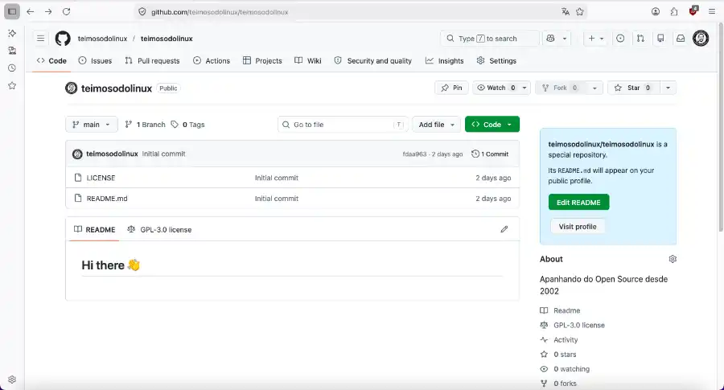

+++
title = "Prologue: 12 Hours, 3 Comment Systems and a (Almost) Functional Blog"
date = 2026-05-06
draft = false
slug = "prologue-blog-almost-functional"
tags = ["hugo", "linux", "blog", "open-source", "github-pages"]

[cover]
    image = "images/Prologo-Aperture.webp"
    alt = "Old School Monitor"
    relative = true
+++

I had a simple goal: start a blog to share my technical adventures and misadventures involving Linux, free software and related subjects. I came up with a solid structure, an honest layout, did some research on platforms and that was it — I decided to host everything on GitHub. It seemed like a logical and natural path, since a blog about Open Source *has* to live on GitHub, right?

Seemed right.

They say setting up a static blog with Hugo is *"quick and easy"*. That's what the YouTube tutorials, recorded by people who probably don't own an FX-6300 and a genetic inclination toward stubbornness, try to sell you. The reality? It's trench warfare against `.toml` files and folder hierarchies that look like they were designed by a sadistic architect.

---

## The Original Plan

The idea was simple: get **Teimoso do Linux** online.

- **Engine:** Hugo
- **Theme:** PaperMod
- **Goal:** have a place to document my technical shenanigans without the distractions of social media

Everything was going reasonably well, until I thought:

> *"But it would be nice to have a comment section at the bottom. After all, every blog has one."*

Little did I know that this "final act" — configuring a simple comment box — would become my **final boss**.

<p align="center">
  
  <br><em>Creating a GitHub account was the easy part.</em>
</p>

---

## The Tools Odyssey

### 1. Disqus — *The Traditional Route*

*"If master Fabio Akita uses it, I'll use it too"*, I thought. Let's go with Disqus. I configured the shortname, adjusted the configuration file and... nothing. The footer remained a desert of grey pixels.

Disqus is like that proprietary driver you know should work, but decides to go on strike without emitting a single error log.

### 2. Giscus — *The Nerd Route*

I turned to Giscus. *"Let's use GitHub Discussions!"*, I shouted at the walls. The result? The blog, in an act of pure rebellion, decided to **render the script source code on screen** instead of executing the tool.

Seeing your own HTML code printed as if it were a concrete poem is a transcendental experience, but not particularly functional.

### 3. Cactus.chat — *The Privacy Route*

I tried to be ethical. I tried to be minimalist. Cactus.chat promised Matrix-based comments, no tracking and a clean interface.

Hugo responded by displaying only the title *"Comments"*, followed by an existential void.

---

## The Goldmark "Scream"

Along the way, I discovered that Hugo has a security system called **Goldmark** that, by default, treats any "strange" HTML as a biological hazard.

I tried to disable the lock with the famous:

```toml
unsafe = true
```

Hugo not only ignored the command, but *screamed* syntax errors that made me question whether I still knew how to read a configuration file.

<p align="center">
  
  <br><em>Nothing like an exasperating day of combat against the terminal.</em>
</p>

---

## Lessons From a Day of Combat

After hours editing partials, creating layout overrides and restarting the server (`hugo server -D`) more times than I rebooted my first Slackware, I reached an important conclusion:

> **"Done" is better than "perfect", but "posted" is better than "exhausted".**

The blog is live. The tags are there. The search *(which also put up a fight!)* is operational. The design is clean.

The absence of comments right now might be the universe sending a warning: before listening to other people's opinions, I first needed to finish setting up my own space.

---

## Next Steps

If you're reading this and want to comment — sorry: you can't. At least not today. The comment box is still an urban myth on this domain. I certainly forgot a misplaced comma in some hidden configuration file, or deleted something I shouldn't have.

But rest assured: **the stubbornness is not dead**. It just went to sleep to avoid throwing the laptop out the window.

---

*Verdict:* **Hugo 1 × 0 Sanity.** *(But there will be a rematch.)*