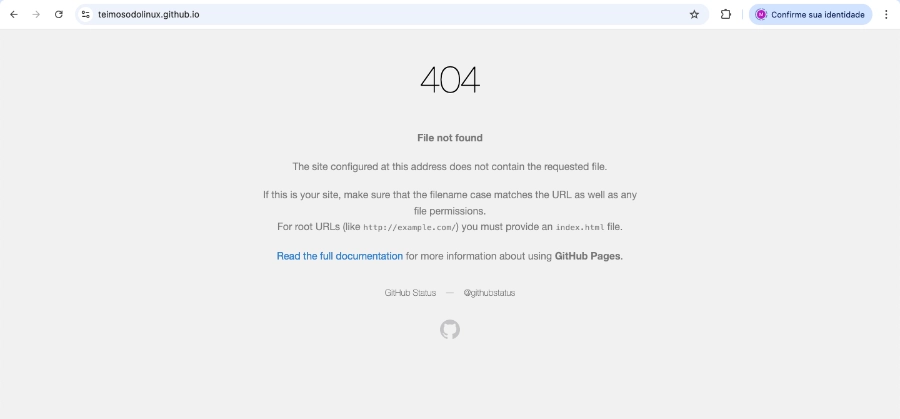

+++
title = "Almost Defeated by a Stray Slash // Not Everything Is What It Seems"
date = 2026-05-07
draft = false
slug = "almost-defeated-stray-slash"
tags = ["github", "hugo", "linux", "blog", "configuration"]

[cover]
    image = "images/header-1200x630.webp"
    alt = "404 madness"
    relative = true
+++

In the previous post, I talked a big game, bragged about how I had managed to get the blog up and running almost perfectly. Bullshit. It was a beating. I was almost defeated by a stray slash in a markdown file. At least now I have at least one functional comment field — I think. It still needs testing in production.

The first cold shower was pushing the blog live after the official commit and seeing that exasperating 404 error message. "Oh come on, now what? This never happened on Blogger..."

I turned to the only resource available to a panicking analog dinosaur: asking the AI for help. And the help came in the form of a humiliating checklist of obvious things I hadn't done. GitHub Pages doesn't activate itself after a commit — it needs to be manually enabled in the repository settings. Minor detail. Easily overlooked. Especially when you're convinced you did everything right.

 

  
   <em>Everything seemed to be going so well.</em>

 

With Pages sorted, the second problem arrived: the GitHub Actions workflow. Hugo isn't a static site you simply dump into a folder — it needs to be *compiled*. Actions does this automatically on every push, but the configuration file needs to exist, be in the right place, and contain exactly what it should. One wrong line and the dot turns red. Several red dots later, the dot finally turned green. Partial victory.

Partial because the site came up showing raw XML in the browser. No style. No layout. Nothing. It looked like RSS feed content dumped on screen — because that's exactly what it was. The PaperMod theme wasn't loading. Reason: it was registered as a git submodule without me fully understanding what that meant in practice. One line in the workflow later — `submodules: recursive` — the theme came back to life.

 

  
   <em>Now we're talking. Except not really.</em>

 

Then came the images. I organized everything neatly into folders inside each post, referenced the files in the markdown, pushed everything up. The images didn't appear. The problem? A slash. A single slash at the beginning of the path: `/images/photo.webp` instead of `images/photo.webp`. With the slash, Hugo looks for the file at the site root. Without it, it looks inside the post folder. The difference between working and not working is a single character that fits inside a comma.

 

  
   <em>Who hasn't been there?</em>

 

In total: 404, broken workflow, missing theme, invisible images, and an irresponsible number of commits with increasingly unprofessional messages. The blog is live. The images show up. The layout works. The comment field miraculously exists — whether it actually works or not, well, that's a whole other story.

Sometimes winning is just not giving up and being a little more stubborn until the dot turns green.