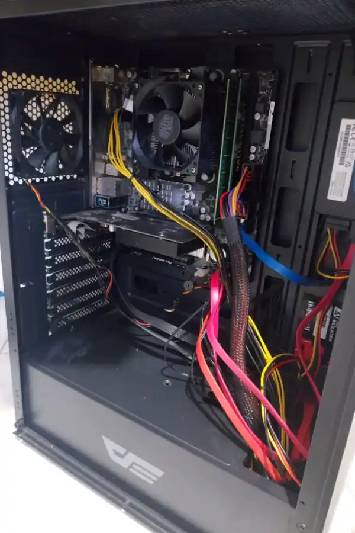
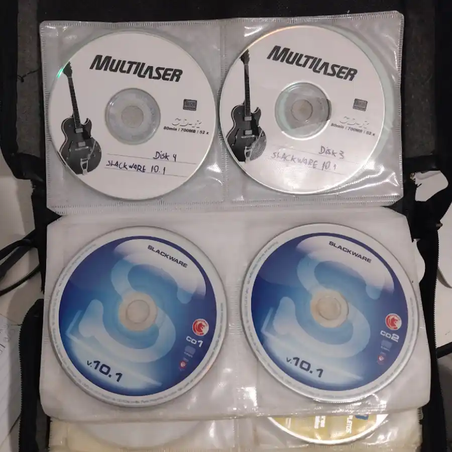
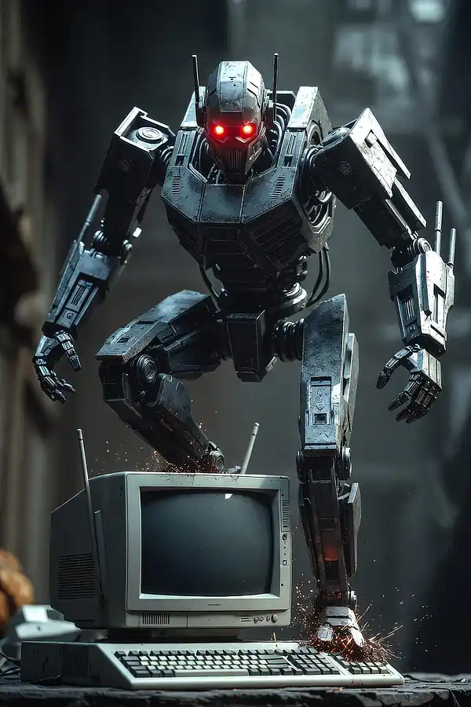

+++
title = "Welcome to the Stubborn Linuxer: The Birth of TDL-Lab"
date = 2026-05-12
description = "A formal introduction to TDL-Lab: the machines, the philosophy, and the survival plan for running Linux on unlikely hardware."
draft = false
slug = "tdl-lab"
tags = ["Linux", "Slackware", "Arch", "Misadventures", "AI"]
categories = ["Logbook"]
author = "Marcelo Souza"
showToc = true

[cover]
    image = "images/header-1200x630.webp"
    alt = "Stubborn Linuxer Lab"
    relative = true
+++

Before the first boot, there was only the void…

Or rather: there was an **FX-6300** with 8 GB of RAM, an **Nvidia GeForce GT-610** graphics card that can barely render a desktop, a 1 TB HDD eager to host AI models, and the stubbornness of someone who could never quite quit Linux for good.

  
   <em>Old but running Linux. Suck on that, Windows 11.</em>

 

My name is Marcelo Souza (or just “The Stubborn One”), I’m a Designer by trade, an old-school nerd/geek, and this is [**teimosodolinux.github.io**](https://teimosodolinux.github.io) — a technical and existential logbook of my adventures (and misadventures) with Linux in 2026.

## Why “Stubborn Linuxer”?
Because that word perfectly defines my relationship with the OS.

From the ancient **Mosaic** browser on Windows 3.1, to burning **Kurumin** on rewritable CDs in college, to the **Slackware 10.1** that made me format my drive more often than I changed my clothes, and through chronic *distro hopping* (Debian, Ubuntu, Conectiva, Kalango…), I’ve always crawled back to Slackware even after swearing off that heavy drug. The stubbornness to keep trying simply persisted.

  
   <em>A bit of nostalgia in disc format.</em>

 

I’m not a power user — far from it. I’m not a total beginner either. I’m stuck right in the middle, leaning more toward "noob" than "expert." I’m not from IT, I’m not a programmer, nor a software engineer. I’m just a designer who’s been messing with computers since the 90s. Or earlier. I can’t even remember when the MSX was released in Brazil. Several RAM sticks have already fried in my mind.

> I even tried to start a BBS called **KID FOFURA BBS** in the prehistoric "time before time." Spoiler: it was a glorious failure.

## The TDL-Lab
This blog serves as the official record of **TDL-Lab // Laboratório Teimoso do Linux**, which, despite the fancy name, isn’t much of a lab. It’s just a home office with a desktop, a laptop, a printer, a couple of desks, and a lot of hoarded tech junk. Yes, I am a sick hoarder.

But in an attempt to give some useful purpose to my neuroses and manias—and trying to embrace the modern spirit of social media—I decided to document and publicize everything to the universe. At the very least, a record of this inconsistency will remain for the future.

Don’t judge me. You won't find "perfect tutorials" from a know-it-all here. You’ll find real experimentation, silly mistakes, duct-tape solutions, and old hardware being brought back from the dead.

  
   <em>Good old organized chaos.</em>

 

### The current lab setup:
* **Main Desktop:** AMD FX-6300, 8 GB RAM, NVIDIA GT 610, ASRock 760GM-HD motherboard;
* **MacBook Air:** Main workstation (design and productivity);
* **Windows 10:** Installed on the desktop for compatibility and fallback;
* **Dedicated Drives:** One for each Linux distro (**Slackware** and **Arch**, for now);
* **Printers**: One HP all-in-one, a pair of vintage scanners;
* **Stockpiled obsolete junk**: Countless items.

## The big news: AI has joined the game
What makes this new phase truly exciting is a tool I didn't have in my past adventures: **Artificial Intelligence**.

  
   <em>Claude, are you still there?</em>

For the first time, I have a technical partner by my side in real-time, suggesting commands, explaining errors, and putting up with my crazy ideas like running **ComfyUI** on CPU-only on a 2013 machine. This has changed the game by nearly 200%. I used to spend hours lost in obscure forums and searching for hidden blogs in the deep web. Today, I still suffer, but I suffer in a much smarter and more entertaining way.

## Goal of this blog
Document everything: successes, epic fails, lessons learned, and tests. Don’t expect structured or organized content—you might learn something by osmosis, but what really matters is the journey and the entertainment. My entertainment, of course.

**Upcoming practical goals:**
1. Installing **Arch Linux**;
2. Resurrecting **Slackware** in 2026 (Digital Archaeology);
3. First steps with **ComfyUI** on CPU-only (get the coffee ready).

**Shall we boot?**