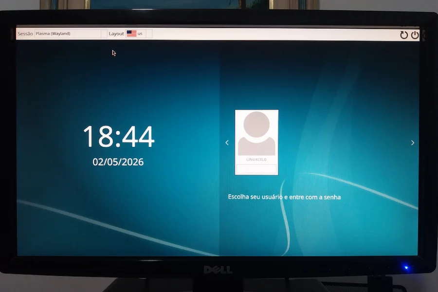
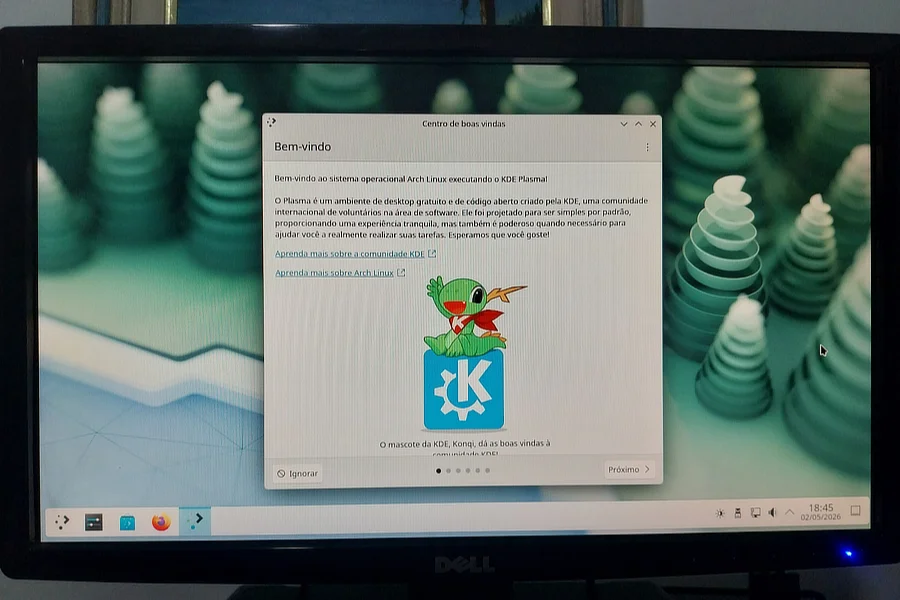

+++
title = "Surviving the first contact with Arch Linux"
date = 2026-05-14
description = "Is Arch Linux in 2026 really the seven-headed beast the legend describes? Spoiler: no."
draft = false
slug = "arch-linux-first-install"
tags = ["Linux", "Slackware", "Arch", "Misadventures", "BTRFS", "KDE", "Plasma"]
categories = ["Ship's Log"]
author = "Marcelo Souza"
showToc = true

[cover]
    image = "images/header-1200x630.webp"
    alt = "Installing Arch"
    relative = true
+++

# Surviving the first contact with Arch Linux

A slight exaggeration on my part — I've had contact with Arch Linux before. Long before systemd, back when it used a logical and rational init system. Sometime last century, perhaps? I'd been away from it for a long time. But that's beside the point.

The point is, I need to be honest right from the start: I shouldn't be writing this post.

Not because something went wrong. Quite the opposite — because it went too well, too fast, without enough drama to justify the historical dread I had for Arch Linux. Which, let's be honest, is almost disappointing for a blog called Stubborn Linuxer.

But let's start from the beginning.

## How I got here

This blog was born from Slackware. The original idea was to explore the possibilities of running modern AI image generation tools — specifically ComfyUI — on good old Slack 15. I researched, asked around, dug through obscure forums. The answer was gentle but unforgiving: Slackware 15 stable has a Python version too old for that, and Slackware-current — the development branch — carries an official warning that it's a testing ground, not meant for real production use, and if something breaks, you're on your own. It ends with a "you've been warned," which isn't exactly inspiring for someone who just wants things to work.

After a lot of brainstorming — the kind that happens with the machine open and hands full of screws — I reached a conclusion that cost me some pride: to run ComfyUI with any sanity, Arch is the least masochistic option available.

 

  
   <em>Surgery to add more storage.</em>

 

Slackware 15 stable gets a smaller SSD as a digital zoo, a low-pressure experiment lab, a generous source of content for this blog. Everything in its place. And so, with the slightly wounded dignity of a card-carrying Stable Slacker, I opened the Arch installer.

## The installation: when the enemy surprises you

Arch Linux in 2026 is not the seven-headed beast the legend describes. It has a text-based installer that walks you through the process with straightforward questions. I answered them one by one, often without fully understanding what I was choosing, relying on prior research and consultations with my technical advisors, while sitting in front of the keyboard.

I chose BTRFS as the filesystem — for a simple reason: it lets you create "snapshots" of the system before updates, so if something breaks, you can roll back. For someone running Arch — famous for updates that occasionally surprise — that's less a luxury and more an emotional necessity.

I chose the Zen Kernel, which promises better performance for this kind of workload. I chose Plasma with Wayland. And kept going.

I had a genuine moment of doubt when the installer asked about snapshots — those system photographs. A new option called Snapper appeared, which I didn't know. I looked it up on the spot, found it was exactly what I needed, and confirmed. The installer handled the rest.

There was also something I didn't expect to find: an option called plasma-login-manager, described as KDE's new login manager, still in development. The temptation to experiment lasted about thirty seconds. Then I remembered I was already stepping outside my comfort zone enough for one day, and stuck with the good old reliable SDDM.

## The moment of truth

System installed. First reboot.

GRUB appeared. Plasma came up. No black screen. No error message. No kernel swearing at me in hexadecimal.

 

  
   <em>So far, so good.</em>

 

It worked. I was genuinely amazed to see Arch Linux simply working on the first try, after years of hearing horror stories. It's almost like showing up to a duel expecting a fight and having your opponent offer you coffee.

## A few lessons learned along the way

After the system came up, there was still work to do — configuring virtual memory, creating the swap file, tweaking details the installer doesn't cover. I'll admit I was navigating unfamiliar waters here, supported by research and outside guidance to avoid mistakes that BTRFS charges dearly for.

BTRFS, for instance, has a complicated relationship with swap files that I never would have figured out on my own. There are specific steps that need to happen in a specific order — otherwise the result can be silently catastrophic. I won't pretend I knew that going in.

The lesson is simple and old: knowing what you don't know is just as important as what you do know. Arch rewards those who research before acting. And punishes those who don't with the same quiet indifference. I'll truly learn that someday. Hopefully before I break the system.

## The feeling that stays

Using Arch has a specific quality worth naming: it's like living in an apartment on top of a dormant volcano. Beautiful, functional, great location. But with every system update you wonder if today is the day of the Kernel Panic.

That feeling doesn't go away with time. Arch users know it's always there. Snapper doesn't eliminate the volcano — it just puts up a signposted escape route.

Slackware 15, on the other hand, is a solid house built on stable ground. You know exactly what you have, you know it won't change anything without your permission, and you sleep soundly. The price is paying in blood, sweat, and tears for every slightly complex novelty you want to bring in from outside.

Two different paradigms. Two different kinds of stubbornness.

 

  
   <em>KDE Plasma in all its glory.</em>

 

For now, Arch has earned a specific role in this setup: running ComfyUI while the processor sweats buckets generating images. Slackware 15 on the smaller SSD stays alive, breathing, full of poorly explained experiments waiting for a post.

The Stubborn Linuxer gave up a little ground. But didn't lower his guard.

## Coming up next...

Installing ComfyUI on Arch (or trying to), and finding out how many minutes the processor needs to produce something that remotely resembles an image.
