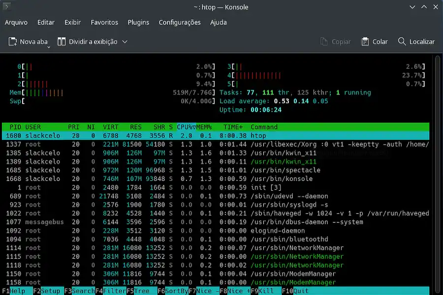

+++
title = "Slackware 15 Installation: Why Install Slackware Linux in 2026? Why Not?"
date = 2026-05-16
description = "Installing Slackware 15.0 in 2026 on a multi-boot system — with LILO tamed by hand and a modern swapfile in place of a fixed partition."
draft = false
slug = "slackware-linux-first-installation"
tags = ["Slackware", "linux", "installation", "swap", "lilo", "GT-610", "Nvidia", "GeForce"]
categories = ["Ship's Log"]
author = "Marcelo Souza"
showToc = true

[cover]
    image = "images/header-1200x630.webp"
    alt = "Installing Slackware"
    relative = true
+++

*Logbook, Stardate 1337.15*

Today is Slackware day, Stubborn ones! Time to install the grandfather of them all, again, for the thousandth time. Though it's only the fourth or fifth installation of it in 2026. Hopefully the last one.

Before you ask: why on earth install Slackware Linux in 2026? It's Jurassic, has no automatic dependency resolution, is a pain to maintain over time, and its current release — 15.0 — is already showing its age, getting a bit too stale for comfort. And I ask back: why not? It'll be instructive at the very least, even fun. For a nerd, anyway.

<br><p align="center">
  
  <br><em>Slackware Linux in action.</em>
</p><br>

I like to imagine that here at TDL-Lab — the Stubborn Linux Lab —, everything has a clear purpose, no matter how absurd it may seem. That's not true, of course. Anyway: the next purpose is actually quite straightforward, though not necessarily easy. It's to get Slackware 15 to compile, install, and properly run the proprietary driver for my Nvidia GeForce GT-610 graphics card again. After all, it managed to do that in the past. Just because graphics stacks, kernels, and Xorgs have moved on, and Nvidia Corporation itself dropped support for the card's proprietary driver, doesn't mean it can't work again.

> **Disclaimer:** It most likely won't work. Estimated success rate: 35%, if we're lucky.

Stay calm — I have a plan to test things, make the magic happen, and get everything running smoothly. It's a foolproof plan! But first things first: we need to install our old companion onto the drive. SSD, actually. This is where the technical adventure begins, folks!

---

## Partitioning without waste: goodbye, swap partition

The drive in question is modest: 60GB. Nothing that justifies wasting 4GB or more on a fixed, immutable swap partition, carved in stone as if it were 1998. The civilized solution — and surprisingly more flexible — is the swapfile.

With a swapfile, you can grow, shrink, or delete swap without touching the partition table. Need more headroom tomorrow while compiling a heavy kernel? Expand it. Want to reclaim space afterward? Delete and recreate it smaller. Simple as that.

The process only requires a bit of manual attention right after the base installation, before the first reboot — exactly the kind of thing Slackware lets you do without complaining, unlike certain distributions that seem to think you can't be trusted. I can't, but life goes on.

---

## The detail that could have blown everything up: LILO

Before getting to the swap part, though, a silent trap was waiting for me: the LILO installation, Slackware's legendary bootloader.

By default, the installer tends to be... let's say, overly enthusiastic when choosing where to write the bootloader. On a system with more than one drive — like mine, which peacefully coexists with a Windows HD and an Arch Linux drive —, letting LILO decide on its own is an invitation to disaster. It could very well install itself on the wrong drive, overwrite the Windows bootloader, and turn a lab installation into an emergency recovery afternoon.

<br><p align="center">
  
  <br><em>Yes, we also have the trusty Screenfetch.</em>
</p><br>

To avoid that catastrophe, I used LILO's advanced configuration inside the setup itself, manually specifying the correct disk and partition. No delegation at this stage. The Slackware installer offers this option, and it exists precisely for situations like this.

---

## Creating the swapfile manually

With the base system installed and LILO pointing in the right direction, it was time to set up swap. The installer offers a shell before the reboot — this is where the magic happens.

First, we enter the newly installed system environment:

```bash
# chroot /mnt
```

We create the swap file. For a test lab, 2GB would be a reasonable starting point. We're not reasonable — let's go straight to 4GB:

```bash
# dd if=/dev/zero of=/swapfile bs=1M count=4096
```

Setting the permissions — mandatory step, not optional:

```bash
# chmod 600 /swapfile
```

Formatting and activating:

```bash
# mkswap /swapfile
# swapon /swapfile
```

And to make sure it gets activated automatically on every boot, adding the entry to `/etc/fstab`:

```bash
# echo '/swapfile none swap sw 0 0' >> /etc/fstab
```

To confirm everything is working:

```bash
# swapon --show
# free -h
```

<br><p align="center">
  
  <br><em>We have swap at last.</em>
</p><br>

The swapfile showed up in the list and `free` showed available swap. Mission accomplished.

---

## In the future, if I need to resize

The beauty of the swapfile: resizing is trivial. Deactivate, recreate at the new size, reformat, and reactivate:

```bash
# swapoff /swapfile
# dd if=/dev/zero of=/swapfile bs=1M count=2048
# chmod 600 /swapfile
# mkswap /swapfile
# swapon /swapfile
```

> Note: No partitions were harmed in this process.

Could I have created this swapfile after the first boot? Sure. So why do it before? Good technical question — I have no answer. Taking suggestions.

---

> **For anyone thinking about leaving Windows and installing a Linux distro:** I do **NOT recommend** starting with Slackware. Look up someone who actually knows what they're doing on YouTube and follow their guidance. Trust me — once bitten, twice shy.

---

## First mission report: Completed successfully

The whole process finished without errors. LILO pointed to the right drive, the system came up beautifully after the first reboot, we have swap. Initial login screen functional. The ancient Slackware Linux 15.0 has been officially installed on the TDL-Lab Mustang PC.

---

## Next chapters

Now the interesting — and potentially frustrating — part of the operation begins: getting the GT-610 driver to work on a modern system that no longer wants anything to do with it.

The foolproof plan will be revealed soon. Spoiler: it'll probably fail at least once before it works.

Shall we reboot?
