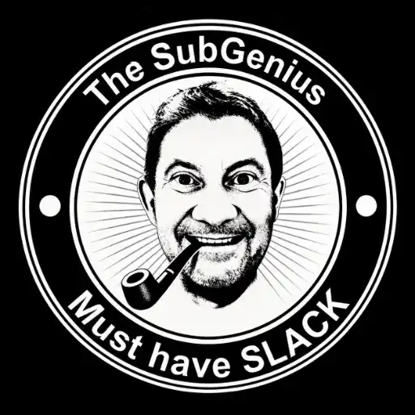

+++
title = "O que um Nerd faz num sábado à noite?"
date = 2026-05-09
draft = false
slug = "o-que-faz-um-nerd"
tags = ["blog", "configuração", "hugo", "papermod", "redes sociais", "Batman"]

[cover]
    image = "images/header-1200x630.webp"
    alt = "Sábado a noite"
    relative = false
+++

Certamente ele não sai por aí, travestido de morcego, procurando criminosos fantasiados de palhaço para espancá-los.

Ele escova bits. Obviamente.

Enquanto o mundo lá fora fazia coisas de mundo lá fora, eu estava aqui no meu home office — entre a mesa do computador, a mesa do notebook e a prancheta de desenho — resolvendo as últimas pendências de configuração do blog. Vida social anoréxica, como manda o manual do nerd raiz.

Mas foi uma noite produtiva. E produtividade merece registro.

---

## Exorcizando o fantasma do "Sobre"

O primeiro bug caçado pela noite foi sutil. Ao usar a busca do blog, digitar "S" ou "Sobre" retornava um resultado apontando para uma página *Sobre* — que não existia. Página fantasma. Assombração de configuração antiga.

O culpado: um arquivo `content/sobre.md` esquecido num canto, remanescente de uma tentativa anterior. O menu havia sido removido, mas o arquivo ficou pra trás. O Hugo indexou o conteúdo na busca mesmo sem link de navegação. Um `rm` cirúrgico e um `hugo --gc` depois, o fantasma foi exorcizado.

Primeira lição da noite: no Hugo, deletar do menu não é o mesmo que deletar o conteúdo.

---

## Bio atualizada, identidade consolidada

Aproveitei para atualizar a bio do blog para espelhar exatamente o que está nas redes sociais:


> *"Dinossauro analógico da era DOS, apanhando do Open Source desde 2002 e perdendo a sanidade mental por uso excessivo do Xterm."*


<br>
<p align="center">
  
  <br><em>Fina estampa.</em>
</p><br/>
---

## O Favicon e a saga do browser errado

Todo blog que se preze precisa de um favicon — aquele ícone minúsculo que aparece na aba do browser e que 90% das pessoas ignora, mas cuja ausência incomoda demais quem sabe que deveria estar lá.

Tentei com PNG. Não funcionou. Tentei com SVG. Nada. Converti para o velhíssimo formato `.ico` com auxílio de um conversor online — e funcionou de primeira.

O formato legado vence de novo. Nem sempre o moderno é melhor; às vezes é só mais chato.

O detalhe tragicômico da noite: passei alguns minutos dando reload freneticamente para ver se o ícone aparecia, sem resultado algum. Quando percebi, estava dando F5 no endereço do GitHub Pages — não no servidor local. O blog estava rodando em `localhost:1313` o tempo todo.

Quem nunca.

---

## Ícones sociais no tema

O PaperMod, tema do motor Hugo usado aqui no Blog, tem suporte nativo a ícones sociais, e o tema já conhece o X (ex-Twitter) e o Instagram. Bastou adicionar as entradas no `hugo.toml`:

```
[[params.socialIcons]]
  name = "x"
  url = "https://x.com/teimosodolinux"

[[params.socialIcons]]
  name = "instagram"
  url = "https://instagram.com/teimosodolinux"
```

Funcionou na primeira tentativa. Estou ficando bom nisso.

<br>
<p align="center">
  
  <br><em>Elon Musk, meu camarada.</em>
</p>
<br>
---

## As Redes Sociais existem. Tenho provas.


O **Teimoso do Linux** já tem presença confirmada no X e no Instagram, ambos com o handle `@teimosodolinux`. E para provar que isso não é só conversa, eis o primeiro post oficial do projeto nas redes:




"Uso Linux não porque ele seja bom. Uso Linux porque sou teimoso."

Filosofia resumida em 140 caracteres.


---

## Ponto final (por hoje)

Blog com favicon, bio consolidada, fantasmas removidos, redes sociais no ar e ícones funcionando. As configurações pesadas estão encerradas — oficialmente, ou pelo menos oficiosamente.

O próximo post será a apresentação formal do blog e do projeto. Isso se algo mais não quebrar no meio do caminho. Mas isso é para outro dia.

Por hoje, o Teimoso vai dormir. Os bits estão suficientemente escovados.

---

## Epílogo: cantei vitória cedo demais

Falei que estava ficando bom nisso. Cantei vitória cedo demais.

O blog ruiu mais rápido que um castelo de cartas nas tentativas de inserir um snippet do Twitter. O servidor crashou, o log cuspiu erros em série, e a causa raiz foi simples e humilhante: o Hugo evoluiu, o Elon Musk renomeou o Twitter para X, e o mundo inteiro teve que atualizar suas configs em consequência.

O shortcode `` foi removido no Hugo v0.156.0. O correto agora é ``. E o bloco de privacidade no `hugo.toml` que antes era `[privacy.twitter]` passou a ser `[privacy.x]`. Dois detalhes. Dois crashes. Um xingamento mental ao Elon Musk. E um pro Bill Gates também, só pra não perder o costume.

Nota mental: repensar seriamente essa mania de ficar embedando coisas no blog.

---

*Escrito num sábado à noite, com o Hugo server aberto numa aba e o GitHub em outra — às vezes na aba errada. O Cláudio entregou o rascunho em YAML. O blog usa TOML. O Cláudio sugeriu `privacy.twitter`, já deprecado. O Teimoso colou o log. Equilíbrio restaurado, duas vezes.*

*Quem diachos é "Cláudio"? É só um dos meus assessores virtuais de IA. Claude era formal demais pra mim, Jarvis já estava registrado. Um "rebrand" para Cláudio era a única solução óbvia, logicamente.*
