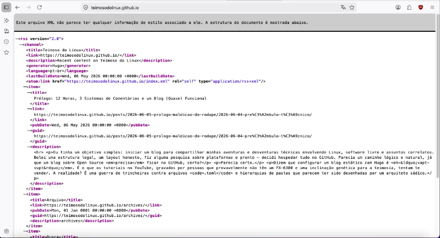
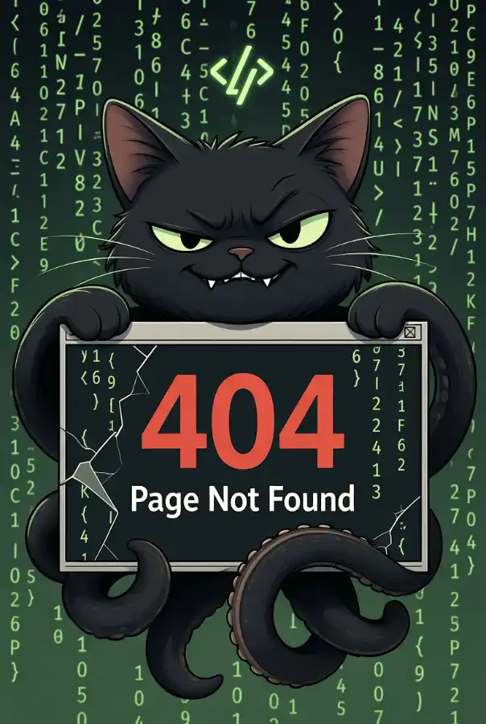

+++
title = "Quase derrotado por uma barra inadvertida // nem tudo é o que parece"
date = 2026-05-07
draft = false
slug = "quase-derrotado-barra-inadvertida"
tags = ["github", "hugo", "linux", "blog", "configuração"]

[cover]
    image = "images/header-1200x630.webp"
    alt = "404 madness"
    relative = true
+++

No post anterior, eu coloquei muita banca, contei vantagem de como havia conseguido subir o blog de maneira quase perfeita. Bullshit. Foi uma surra. Quase fui derrotado por uma barra invertida no arquivo markdown. Pelo menos agora já tenho ao menos um campo de comentários funcional, eu acho. Ainda precisa de testes em produção.

O primeiro banho de água fria foi subir o blog, após o commit oficial, e ver a exasperante mensagem de erro 404. "Ora bolas, e mais essa agora? No Blogger não é assim..."

Recorri ao único recurso disponível para um dinossauro analógico em pânico: pedir socorro para a IA. E o socorro veio na forma de um checklist humilhante de coisas óbvias que eu não havia feito. O GitHub Pages não se ativa sozinho após um commit — precisa ser habilitado manualmente nas configurações do repositório. Detalhe menor. Facilmente ignorável. Especialmente quando você está convicto de que fez tudo certo.

 

  
   <em>Tudo parecia indo tão bem.</em>

 

<!-- IMAGEM: algo ilustrando erro 404, pode ser screenshot ou ilustração -->

Resolvido o Pages, veio o segundo problema: o workflow do GitHub Actions. O Hugo não é um site estático que você simplesmente joga numa pasta — ele precisa ser *compilado*. O Actions faz isso automaticamente a cada push, mas o arquivo de configuração precisa existir, estar no lugar certo, e conter exatamente o que deve conter. Uma linha errada e a bolinha fica vermelha. Várias bolinhas vermelhas depois, a bolinha ficou verde. Vitória parcial.

Parcial porque o site subiu mostrando um XML cru no navegador. Sem estilo. Sem layout. Sem nada. Parecia o conteúdo de um feed RSS jogado na tela — porque era exatamente isso. O tema PaperMod não estava sendo carregado. Motivo: estava registrado como submódulo git sem que eu soubesse direito o que isso significava na prática. Uma linha no workflow depois — `submodules: recursive` — o tema voltou à vida.

 

  
   <em>Agora sim ficou bom, só que não.</em>

 
<!-- IMAGEM: screenshot do XML cru no navegador, se tiver printado -->

Aí vieram as imagens. Organizei tudo bonitinho em pastas dentro de cada post, referenciei os arquivos no markdown, subi tudo. As imagens não apareceram. O problema? Uma barra. Uma única barra no início do caminho: `/images/foto.webp` em vez de `images/foto.webp`. Com a barra, o Hugo procura o arquivo na raiz do site. Sem a barra, procura dentro do post. A diferença entre funcionar e não funcionar é um caractere que cabe numa vírgula.

 

  
   <em>Quem nunca?</em>

 
<!-- IMAGEM: ilustração ou meme sobre uma barra invertida destruindo tudo -->

No total: 404, workflow quebrado, tema sumido, imagens invisíveis, e uma quantidade irresponsável de commits com mensagens cada vez menos profissionais. O blog está no ar. As imagens aparecem. O layout funciona. O campo de comentários miraculosamente já existe — se ele funciona ou não, aí já é uma outra história.

Às vezes vencer é só não desistir e teimar um pouco mais até a bolinha ficar verde.
