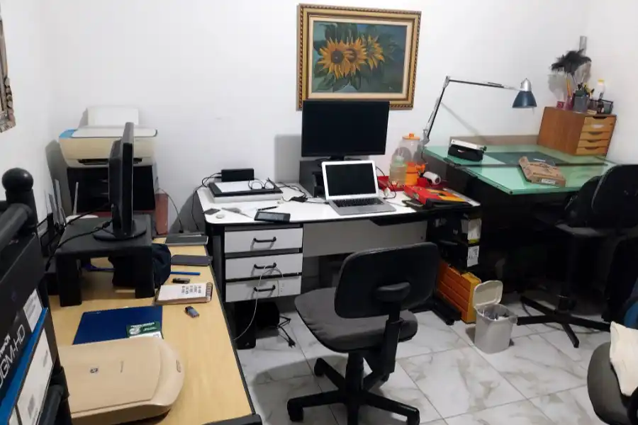

+++
title = "Bem-vindos ao Teimoso do Linux: O Nascimento do TDL-Lab"
date = 2026-05-12
description = "Apresentação formal do TDL-Lab: as máquinas, a filosofia e o plano de sobrevivência com Linux em hardware improvável."
draft = false
slug = "tdl-lab"
tags = ["Linux", "Slackware", "Arch", "Desventuras", "IA"]
categories = ["Diário de Bordo"]
author = "Marcelo Souza"
showToc = true

[cover]
    image = "images/header-1200x630.webp"
    alt = "Laboratório Teimoso do Linux"
    relative = true
+++

Antes do primeiro boot, havia somente o vazio…

Ou melhor: havia um **FX-6300** com 8 GB de RAM, uma placa de vídeo **Nvidia GeForce GT-610** que mal consegue exibir a área de trabalho, um HD de 1 TB ávido por receber modelos de Inteligência Artificial e a teimosia de alguém que nunca conseguiu largar o Linux de vez.

  
   <em>Velho mas rodando Linux. Chupa essa uva, Windows 11.</em>

 

Meu nome é Marcelo Souza (ou apenas “o Teimoso”), sou Designer por formação, nerd/geek *old school* e este é o [**teimosodolinux.github.io**](https://teimosodolinux.github.io) — um diário de bordo técnico e existencial sobre minhas aventuras (e desventuras) com Linux em 2026.

<!--more-->

## Por que “Teimoso do Linux”?
Porque essa palavra define perfeitamente minha relação com o sistema. 

Desde o longínquo navegador **Mosaic** no Windows 3.1, passando pelo **Kurumin** queimado em CD regravável na faculdade, o **Slackware 10.1** que me fez formatar o disco mais vezes que mudei de roupa, o *distro hopping* crônico (Debian, Ubuntu, Conectiva, Kalango…) e as várias vezes que voltei rastejando para o Slackware mesmo depois de jurar nunca mais consumir essa droga pesada, a teimosia de continuar tentando persistia.

  
   <em>Um pouco de nostalgia em formato de disco.</em>

 

Eu não sou um usuário avançado — longe disso. Também não sou um completo iniciante. Fico ali na meiuca, mais para o lado *noob* do que *expert*. Não sou da área de TI, não sou programador, nem engenheiro de software. Sou só um designer que gosta de mexer em computadores desde os anos 90. Ou antes. Não me lembro quando foi lançado no Brasil o MSX. Vários pentes de memória já queimaram aqui na minha mente.

> Cheguei até a tentar levantar uma BBS chamada **KID FOFURA BBS** na época pré-histórica do tempo antes do tempo. Spoiler: foi um fracasso glorioso.

## O TDL-Lab
Este blog nasce como o registro oficial do **TDL-Lab // Laboratório Teimoso do Linux**, que apesar do pomposo nome, de laboratório mesmo não tem nada. É só um home office com um desktop, um notebook, uma impressora, um par de mesas de escritório e muita quinquilharia tecnológica entulhada. Sim, eu sou um acumulador doente. 

Mas pensando em dar algum propósito útil para minhas neuras e manias, e tentando entrar no espírito moderno das mídias sociais, resolvi documentar de algum modo e publicizar tudo ao universo. Futuramente vai restar ao menos o registro de tanta incoerência. 

Não me julgue. Aqui não vai ter tutorial perfeito de quem sabe tudo. Vai ter experimentação real, erros bobos, soluções gambiarra e hardware antigo sendo ressuscitado.

  
   <em>Aquele bom e velho caos organizado.</em>

 

### O setup atual do laboratório:
*   **Desktop principal:** AMD FX-6300, 8 GB RAM, NVIDIA GT 610, placa ASRock 760GM-HD;
*   **MacBook Air:** Estação de trabalho principal (design e produtividade);
*   **Windows 10:** Instalado no desktop para compatibilidade e *fallback*;
*   **Discos dedicados:** Um para cada distro Linux (**Slackware** e **Arch**, por enquanto);
*   **Impressoras**: Uma multifuncional HP, um par de scanners vintage;
*   **Tralhas obsoletas estocadas**: Inúmeras.

## A grande novidade: a IA entrou no jogo
O que torna essa nova fase realmente empolgante é uma ferramenta que eu não tinha nas minhas aventuras passadas: a **Inteligência Artificial**. 

  
   <em>Claude, você ainda está aí?</em>

Pela primeira vez tenho um parceiro técnico que me acompanha em tempo real, sugere comandos, explica erros e ainda aguenta minhas ideias malucas de rodar **ComfyUI** só em CPU numa máquina de 2013. Isso mudou o jogo em quase 200%. Antes eu passava horas perdido em fóruns obscuros e pesquisando blogs ocultos pela interwebs. Hoje eu ainda sofro, mas sofro de forma muito mais inteligente e divertida.

## Objetivo deste blog
Documentar tudo: sucessos, fracassos épicos, aprendizados e testes. Não espere um conteúdo estruturado ou organizado — talvez você possa até aprender algo por osmose, mas o importante mesmo é a jornada e o entretenimento. O meu entretenimento, claro.

**Próximos objetivos práticos:**
1. Instalação do **Arch Linux**;
2. Ressurreição do **Slackware** em 2026 (Arqueologia digital);
3. Primeiros passos com **ComfyUI** só em CPU (preparem os cafés).

**Vamos bootar?**