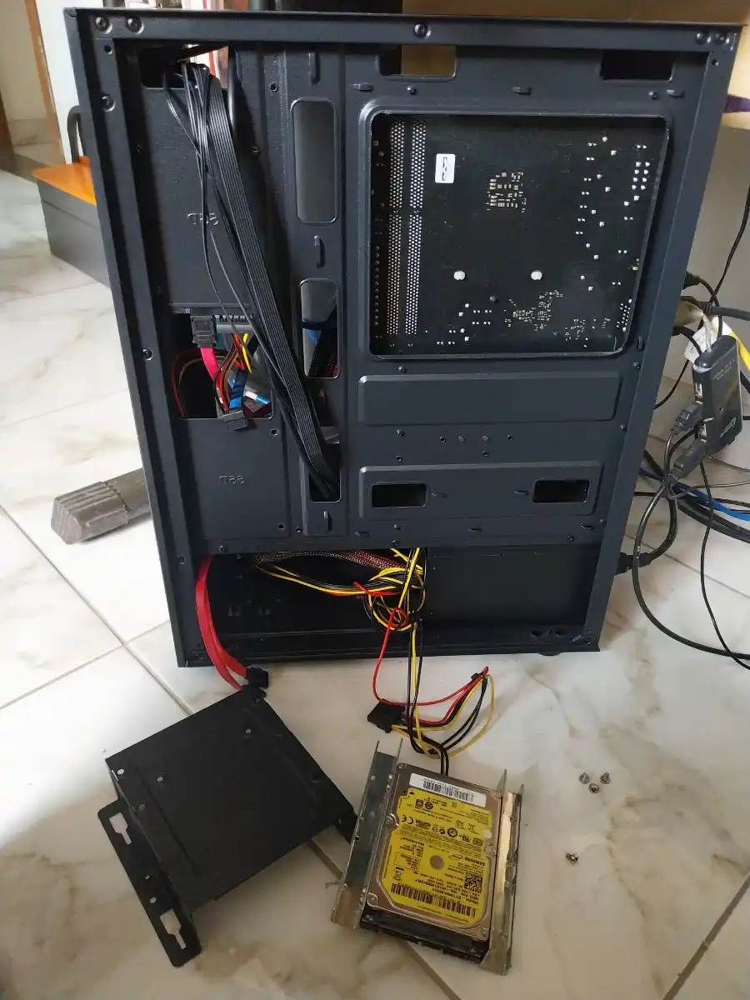

+++
title = "Sobrevivendo ao primeiro contato com Arch Linux"
date = 2026-05-14
description = "O Arch Linux de 2026 é mesmo aquele bicho de sete cabeças que a lenda descreve? Spoiler: não."
draft = false
slug = "arch-linux-primeira-instalacao"
tags = ["Linux", "Slackware", "Arch", "Desventuras", "BTRFS", "KDE", "Plasma"]
categories = ["Diário de Bordo"]
author = "Marcelo Souza"
showToc = true

[cover]
    image = "images/header-1200x630.webp"
    alt = "Instalando Arch"
    relative = true
+++

# Sobrevivendo ao primeiro contato com o Arch Linux

Certo exagero meu, já tive contato com o Arch Linux anterioremente. Muito antes do systemd, quando ele usava um Init System lógico e racional. Talvez no século passado? Estive apartado dele por longo tempo.  Mas isso não vem ao ponto agora. 

O ponto é que preciso é ser honesto logo de cara: eu não deveria estar escrevendo este post.

Não porque algo deu errado. Pelo contrário — porque deu certo demais, rápido demais, sem drama suficiente para justificar o pavor histórico que eu nutria pelo Arch Linux. E isso, convenhamos, é quase decepcionante para um blog chamado Teimoso do Linux.

Mas vamos ao começo.

## Como cheguei até aqui

Este blog nasceu do Slackware. A ideia original era explorar as possibilidades de rodar ferramentas modernas de geração de imagens via IA — especificamente o ComfyUI — no bom e velho Slack 15. Pesquisei, perguntei, fuçei fóruns obscuros. A resposta foi gentil mas implacável: o Slackware 15 estável tem um Python velho demais para essa história, e o Slackware-current — a versão em desenvolvimento — tem um aviso oficial alertando que ele é um campo de testes, não deve ser usado em ambiente de produção real e se algo der errado, você estará por sua conta e risco. E termina com um "você foi avisado", o que não inspira muita confiança para quem quer que as coisas funcionem.

Depois de muito brainstorming — o tipo de conversa que acontece com a máquina aberta e as mãos cheias de parafuso — cheguei a uma conclusão que me custou algum orgulho: para rodar o ComfyUI com alguma sanidade, o Arch é a escolha menos masoquista disponível.

 

  
   <em>Cirurgia para aditivar mais armazenamento.</em>

 

O Slackware 15 estável ganha um SSD menor como zoológico digital, laboratório de experimentos sem pressão, gerador farto de conteúdo para este blog. Cada coisa no seu lugar. E assim, com a dignidade levemente ferida de um Slacker Stable de carteirinha, eu abri o instalador do Arch.

## A Instalação: quando o inimigo te surpreende

O Arch Linux de 2026 não é o bicho de sete cabeças que a lenda descreve. Tem um instalador de texto que guia o processo com perguntas diretas. Fui respondendo uma a uma, muitas vezes sem entender completamente o que estava escolhendo, confiando numa pesquisa prévia e em consultas aos meus conselheiros técnicos, enquanto sentado na frente do teclado.

Escolhi BTRFS como sistema de arquivos — por uma razão bem simples: ele permite criar "fotografias" do sistema antes de atualizações, de forma que se algo quebrar, você pode voltar atrás. Para quem vai usar o Arch — famoso por atualizações que às vezes surpreendem — isso é menos um luxo e mais uma necessidade emocional.

Escolhi o Kernel Zen, que promete melhor desempenho para esse tipo de uso. Escolhi o Plasma com Wayland. Fui seguindo.

Tive um momento de dúvida genuína quando o instalador perguntou sobre snapshots — aquelas tais fotografias do sistema. Apareceu uma opção nova chamada Snapper, que eu não conhecia. Pesquisei na hora, descobri que é exatamente o que eu precisava, e confirmei. O instalador cuidou do resto.

Teve também uma novidade que não esperava encontrar: uma opção chamada plasma-login-manager, descrita como o novo gerenciador de login do KDE, ainda em desenvolvimento. A tentação de experimentar existiu por uns trinta segundos. Depois lembrei que já estava saindo da zona de conforto o suficiente por um dia, e fiquei com o velho e confiável SDDM.

## O Momento da verdade

Sistema instalado. Primeiro reboot.

O GRUB apareceu. O Plasma subiu. Sem tela preta. Sem mensagem de erro. Sem o kernel me xingando em hexadecimal.

 

  
   <em>Até aqui, tudo correu bem.</em>

 

Funcionou. Fiquei admirado em ver o Arch Linux simplesmente funcionando na primeira tentativa, após passar anos ouvindo histórias de horror. É quase como chegar num duelo esperando uma briga e o adversário te oferecer café.

## Algumas lições aprendidas no caminho

Depois que o sistema subiu, ainda havia trabalho a fazer — configurar a memória virtual, criar o arquivo de swap, ajustar detalhes que o instalador não cobre. Aqui confesso que naveguei em águas que não dominava, apoiado em pesquisa e orientação externa para não cometer erros que o BTRFS cobra caro.

O BTRFS, por exemplo, tem uma relação complicada com arquivos de swap que eu jamais descobriria sozinho. Existem passos específicos que precisam acontecer numa ordem específica, caso contrário o resultado pode ser silenciosamente desastroso. Não vou fingir que sabia disso de antemão.

A lição é simples e antiga: saber o que você não sabe é tão importante quanto o que você sabe. O Arch recompensa quem pesquisa antes de agir. E pune quem não pesquisa com a mesma indiferença tranquila. Um dia ainda vou aprender isso de verdade. Espero que seja antes de quebrar o sistema.

## A Sensação que fica

Usar o Arch tem uma qualidade específica que merece ser nomeada: é como morar num apartamento em cima de um vulcão adormecido. Bonito, funcional, excelente localização. Mas a cada atualização do sistema você se pergunta se hoje é o dia do "Kernel Panic".

Essa sensação não desaparece com o tempo. Quem usa Arch sabe que ela está sempre lá. O Snapper não elimina o vulcão — coloca uma rota de fuga sinalizada.

O Slackware 15, por outro lado, é uma casa sólida construída em terreno estável. Você sabe exatamente o que tem, sabe que ele não vai alterar nada sem você pedir, e dorme tranquilo. O preço é pagar com sangue, suor e lágrimas cada novidade um pouco mais complexa que você quiser trazer de fora.

Dois paradigmas diferentes. Dois tipos de teimosia diferentes.

 

  
   <em>KDE Plasma em toda sua glória.</em>

 

Por enquanto, o Arch ganhou uma função específica neste setup: rodar o ComfyUI enquanto o processador sua em bicas gerando imagens. O Slackware 15 no SSD menor continua vivo, respirando, cheio de experimentos mal explicados esperando por um post.

O Teimoso do Linux cedeu um pouco de terreno. Mas não baixou a guarda.

## Cenas do próximo capítulo...

Instalando o ComfyUI no Arch(ou tentando), e descobrindo quantos minutos o processador leva para produzir algo que se pareça remotamente com uma imagem.
