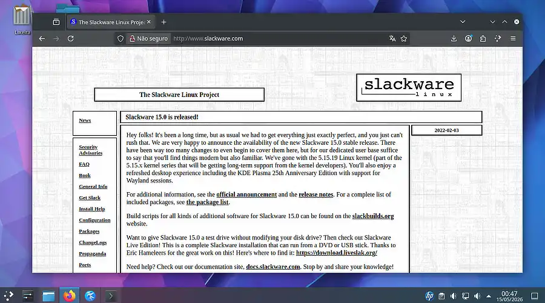
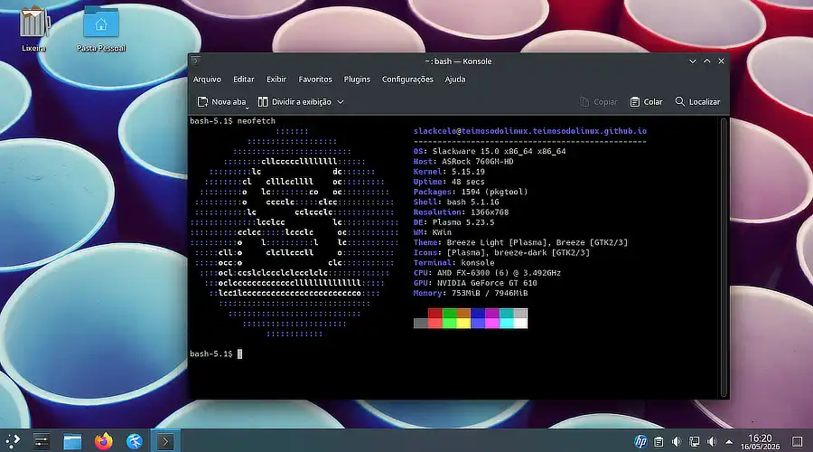

+++
title = "Instalação do Slackware 15: Por que instalar o Slackware Linux em 2026? Por que não?"
date = 2026-05-16
description = "Instalando o Slackware 15.0 em 2026 num sistema multi-boot — com LILO domado na mão e swap moderno no lugar de partição fixa."
draft = false
slug = "slackware-linux-primeira-instalacao"
tags = ["Slackware", "linux", "instalação", "swap", "lilo", "GT-610", "Nvidia", "GeForce"]
categories = ["Diário de Bordo"]
author = "Marcelo Souza"
showToc = true

[cover]
    image = "images/header-1200x630.webp"
    alt = "Instalando Slackware"
    relative = true
+++

*Diário de bordo, Data Estelar 1337.15*

Hoje é dia de Slackware, Teimosos! Hora de instalar o paizão de todos, novamente, pela milésima vez. Mas será só a quarta ou quinta instalação dele em 2026. Espero que seja definitiva.

Antes que se perguntem: por que diabos instalar o Slackware Linux em 2026? Ele é jurássico, não tem resolução automágica de dependências, é complicado de se manter ao longo do tempo, sua versão atual — a 15.0 — já sente o peso do tempo, começando a ficar obsoleto em excesso. E eu pergunto de volta: por que não? Será no mínimo instrutivo, divertido até. Para um nerd, claro.

<br><p align="center">
  
  <br><em>Slackware Linux em ação.</em>
</p><br>

Gosto de imaginar que aqui no TDL-Lab — Laboratório Teimoso do Linux —, tudo tem um propósito claro, por mais absurdo que pareça. Não é verdade, é claro. Voltando: o próximo propósito é até bem prosaico, mas nem por isso mais fácil. É fazer o Slackware 15 compilar, instalar e rodar adequadamente o driver proprietário para minha placa de vídeo Nvidia GeForce GT-610 novamente. Ora pois, ele já conseguiu fazer isso no passado. Só porque os stacks gráficos, kernels e Xorgs da vida foram atualizados, e o driver proprietário da placa teve o suporte abandonado pela sua própria criadora — a Nvidia Corporation —, não quer dizer que ela não possa funcionar novamente.

> **Disclaimer:** O mais provável é que não funcione mesmo. Estimativa aproximada de sucesso: 35%, com sorte.

Fiquem calmos, eu tenho um plano para testar, fazer a mágica acontecer, e tudo rodar de maneira suave. É um plano infalível! Mas antes de tudo, é preciso instalar o nosso velho companheiro no HD. SSD, no caso. É aqui que a aventura técnica começa, rapazes e meninas!

---

## Particionando sem desperdício: adeus, swap partition

O disco em questão é modesto: 60GB. Nada que justifique desperdiçar 4GB ou mais numa partição swap fixa, imutável, gravada em pedra como se estivéssemos em 1998. A solução civilizada — e curiosamente mais flexível — é o swapfile.

Com um swapfile, você pode aumentar, diminuir ou deletar o swap sem tocar na tabela de partições. Quer testar compilar um kernel pesado amanhã e precisa de mais folga? Expande. Quer recuperar espaço depois? Deleta e recria menor. Simples assim.

O processo exige apenas um pouco de atenção manual logo após a instalação base, antes do primeiro reboot — exatamente o tipo de coisa que o Slackware te deixa fazer sem reclamar, ao contrário de certas distribuições que acham que você não é de confiança. Não sou, mas vida que segue.

---

## O detalhe que poderia ter explodido tudo: o LILO

Antes de chegar na parte do swap, porém, uma armadilha silenciosa me esperava: a instalação do LILO, o bootloader histórico do Slackware.

Por padrão, o instalador tende a ser... digamos, entusiasmado demais na hora de escolher onde gravar o bootloader. Num sistema com mais de um disco — como o meu, que convive pacificamente com um HD rodando Windows e outro rodando Arch Linux —, deixar o LILO decidir sozinho é um convite ao desastre. Ele poderia muito bem se instalar no disco errado, sobrescrever o bootloader do Windows e transformar uma instalação de laboratório numa tarde de recuperação de emergência.

<br><p align="center">
  
  <br><em>Sim, também temos o indefectível Screenfetch.</em>
</p><br>

Para evitar essa catástrofe, usei a configuração avançada do LILO dentro do próprio setup, especificando manualmente o disco e a partição corretos. Nada de delegação nessa hora. O instalador do Slackware oferece essa opção, e ela existe exatamente para situações como essa.

---

## Criando o swapfile manualmente

Com o sistema base instalado e o LILO no lugar certo, chegou a hora de configurar o swap. O instalador oferece um shell antes do reboot — é aqui que a mágica acontece.

Primeiro, entramos no ambiente do sistema recém-instalado:

```bash
# chroot /mnt
```

Criamos o arquivo de swap. Para um laboratório de testes, 2GB seria um ponto de partida razoável. Não somos razoáveis — vamos logo para os 4GB:

```bash
# dd if=/dev/zero of=/swapfile bs=1M count=4096
```

Ajustando as permissões — etapa obrigatória, não opcional:

```bash
# chmod 600 /swapfile
```

Formatando e ativando:

```bash
# mkswap /swapfile
# swapon /swapfile
```

E para garantir que ele será ativado automaticamente em todo boot, adicionando a entrada no `/etc/fstab`:

```bash
# echo '/swapfile none swap sw 0 0' >> /etc/fstab
```

Para confirmar que está tudo funcionando:

```bash
# swapon --show
# free -h
```
<br><p align="center">
  
  <br><em>Temos Swap afinal.</em>
</p><br>

Apareceu o swapfile listado e o `free` mostrou swap disponível. Missão cumprida.

---

## No futuro, caso eu precise redimensionar

A beleza do swapfile: redimensionar é trivial. Desativa, recria com o novo tamanho, reformata e reativa:

```bash
# swapoff /swapfile
# dd if=/dev/zero of=/swapfile bs=1M count=2048
# chmod 600 /swapfile
# mkswap /swapfile
# swapon /swapfile
```

> Obs: Nenhuma partição foi ferida nesse processo.

Eu poderia ter criado esse swapfile após o primeiro boot? Poderia. Por que criar antes, então? Boa pergunta técnica, que não sei responder. Aceito palpites.

---

> **Para quem está pretendendo sair do Windows e instalar alguma distro Linux:** eu **NÃO RECOMENDO** iniciar com o Slackware. Pesquise em algum canal no YouTube por alguém realmente entendido na matéria, com orientações seguras. Vai por mim — gato escaldado tem medo de água fria.

---

## Relatório da primeira missão: Concluída com sucesso

Todo o processo terminou normalmente, sem erros. O LILO apontou pro disco certo, o sistema subiu lindamente após o primeiro reboot, temos swap. Tela de login inicial funcional. O ancião Slackware Linux 15.0 foi oficialmente instalado no Mustang PC do TDL-Lab.

---

## Próximos capítulos

Agora sim vai começar a parte interessante — e potencialmente frustrante — da operação: fazer o driver da GT-610 funcionar num sistema moderno que já não quer mais saber dele.

O plano infalível será revelado em breve. Spoiler: ele provavelmente vai falhar pelo menos uma vez antes de funcionar.

Vamos lá rebootar?
